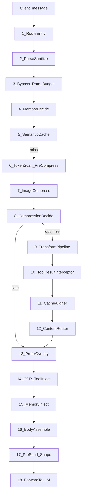

# Headroom request flow (before LLM)

This document maps the stages that run when a client sends a message through the Headroom proxy, from ingress until the request is forwarded upstream. The primary example is the Anthropic HTTP path (`POST /v1/messages`).

OpenAI Chat Completions uses the same compression core (`TransformPipeline` → `ContentRouter`); Responses / WebSocket paths share compressors but differ in wire shape.

## Stage graph

## Stage → files

| Stage | What it does | Primary files |
|------|----------------|---------------|
| 1 Route | Match provider route (e.g. `/v1/messages`) | `headroom/proxy/server.py`, `headroom/providers/proxy_routes.py`, `headroom/providers/route_specs.py` |
| 2 Parse | Read and sanitize JSON body | `headroom/proxy/handlers/anthropic.py`, `headroom/proxy/body_forwarding.py`, `headroom/proxy/helpers.py` |
| 3 Gates | Bypass, rate limit, budget | `headroom/proxy/handlers/anthropic.py`, `headroom/proxy/rate_limiter.py`, `headroom/proxy/cost.py`, `headroom/proxy/model_router.py` |
| 4 Memory decide | Decide whether memory will inject later | `headroom/proxy/memory_decision.py` |
| 5 Semantic cache | Return cached reply on hit (non-stream) | `headroom/proxy/semantic_cache.py` |
| 6 Pre-compress | Token count, security scan, `pre_compress` hooks | `headroom/proxy/handlers/anthropic.py` |
| 7 Images | Compress images in the live turn | `headroom/proxy/image_isolation.py`, `headroom/proxy/image_compression_decision.py` |
| 8 Compress decide | Gate whether transform compression runs | `headroom/proxy/compression_decision.py` |
| 9 Pipeline | Orchestrate transforms | `headroom/transforms/pipeline.py` |
| 10 Tool-result interceptor | Optional AST / tool-result outlines | `headroom/transforms/` interceptors (env-gated) |
| 11 Cache aligner | Prefix / freeze detection (proxy often detector-only) | `headroom/transforms/cache_aligner.py` |
| 12 Content router | Route blocks to compressors + CCR markers | `headroom/transforms/content_router.py`, `headroom/cache/compression_store.py` |
| 13 Prefix overlay | Keep previously forwarded prefix stable | `headroom/cache/prefix_tracker.py` |
| 14 CCR inject | Sticky `headroom_retrieve` tool / markers | `headroom/ccr/tool_injection.py`, `headroom/ccr/context_tracker.py` |
| 15 Memory inject | Append memory context / sticky tools | `headroom/proxy/memory_handler.py` |
| 16 Body assemble | Set `messages` / `tools` / `system` for forward | `headroom/proxy/handlers/anthropic.py`, `headroom/proxy/tool_schema_compaction.py`, `headroom/proxy/system_compaction.py` |
| 17 Pre-send | Turn hooks, tool_search deferral, output shaper | `headroom/proxy/turn_hooks.py`, `headroom/proxy/output_shaper.py` |
| 18 Upstream | Serialize outbound body and POST to provider | `headroom/proxy/body_forwarding.py` → Anthropic / OpenAI / Gemini / … |

Handler entry points:

- Anthropic: `handle_anthropic_messages` in `headroom/proxy/handlers/anthropic.py`
- OpenAI chat: `handle_openai_chat` in `headroom/proxy/handlers/openai.py`
- Gemini: `headroom/proxy/handlers/gemini.py`

## ContentRouter compressors (stage 12)

| Content type | Module |
|--------------|--------|
| JSON arrays | `headroom/transforms/smart_crusher.py` |
| Plain / prose text | `headroom/transforms/kompress_compressor.py` |
| Source code | `headroom/transforms/code_compressor.py` |
| Build / test logs | `headroom/transforms/log_compressor.py` |
| Grep / search output | `headroom/transforms/search_compressor.py` |
| Git diffs | `headroom/transforms/diff_compressor.py` |
| HTML | `headroom/transforms/html_extractor.py` |
| Config (YAML/TOML/INI) | `headroom/transforms/config_compressor.py` |

When CCR markers are enabled, compressors store originals in `headroom/cache/compression_store.py` and embed retrieve markers in the compressed text.

## Feature gates

| Gate | Effect |
|------|--------|
| `optimize=False` / `x-headroom-bypass` / passthrough mode | Skips transform compression; may skip CCR inject |
| `log_full_messages` / `--log-messages` | Does **not** change the transform path; only snapshots `request_messages` vs `compressed_messages` for logging / dashboard |
| `ccr_inject_tool` / `ccr_inject_marker` | Controls CCR tool injection and retrieve markers |
| `memory_enabled` + memory injection mode | Controls memory context / tool injection |
| `HEADROOM_INTERCEPT_ENABLED`, read maturation, tool_search, system compact, output shaper | Optional side paths |

## What the LLM receives

The upstream model sees the **post-pipeline** body:

- `body["messages"]` — compressed live-zone content (+ optional memory / CCR expansions)
- `body["tools"]` — may include sticky `headroom_retrieve` and compacted schemas
- `body["system"]` — optional compaction / CCR instructions

Original full content for CCR hashes stays in the local compression store until the model retrieves it.

## Dashboard mapping

When message logging is on (`headroom proxy --log-messages`):

| Dashboard pane | Pipeline snapshot |
|----------------|-------------------|
| **Origin Text** | Pre-compression client messages (after parse) |
| **Compressed Text** | Messages actually forwarded to the LLM |

See expanded **Recent Requests** rows on `/dashboard`.
