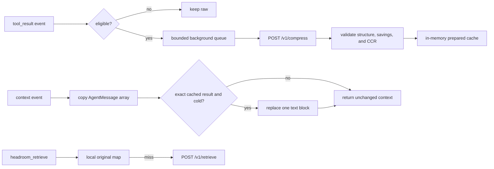

# Native Pi and Oh My Pi Extension Design

## Status

Proposed. This design requires a feature-request issue and a core maintainer's approval before implementation, as required by `CONTRIBUTING.md`.

## Problem

Headroom's current Oh My Pi (`omp`) wrapper starts the Headroom proxy and redirects only OMP's built-in Anthropic provider through a managed `providers.anthropic.baseUrl` override in `~/.omp/agent/models.yml`. OMP providers that do not use that route, including OpenAI Codex and other provider-specific transports, bypass Headroom even though the wrapper still reports that the proxy started.

Pi and OMP expose a shared extension API with a provider-neutral `context` hook. An extension can transform canonical `AgentMessage[]` immediately before provider serialization, regardless of the selected provider. Using that hook removes the need to rewrite provider endpoints and makes Headroom useful to both Pi and OMP users without intercepting inference traffic.

The integration must preserve Headroom's safety invariant: never drop user or assistant content, never break tool-call/result pairing, pass malformed content through unchanged, and prefer a missed compression opportunity over an unsafe rewrite.

## Goals

- Ship one Pi package that runs unchanged in Pi and OMP.
- Compress eligible, cold tool-result text before provider serialization.
- Keep provider credentials, prompts, assistant prose, inference requests, and tool arguments out of extension compression requests.
- Keep the model request path free of network and subprocess work.
- Preserve the raw session transcript; transform only the copied provider context.
- Make every lossy omission retrievable through `headroom_retrieve`.
- Fail open when Headroom is absent, unhealthy, slow, restarted, or returns malformed data.
- Let `headroom deploy`, `headroom wrap`, `headroom doctor`, and `headroom unwrap` own installation and lifecycle.
- Coexist with the existing Anthropic inference-proxy wrapper without changing its provider routing or lifecycle.

## Non-goals

- Routing Pi or OMP inference requests through the Headroom proxy.
- Supporting provider-specific OAuth, WebSocket, or request formats in the extension.
- Compressing user prompts, assistant prose, system prompts, images, tool arguments, errors, or exact source reads.
- Replacing Pi or OMP session compaction.
- Persisting original tool output in a second on-disk extension cache.
- Making remote Headroom endpoints the default.
- Publishing before the package passes the same end-to-end suite in current Pi and OMP.

## User stories

### Golden path

**Given** Headroom is deployed locally, the extension is enabled, and a Pi or OMP session has a large eligible tool result,  
**when** the result becomes older than the protected working set and a later model turn is assembled,  
**then** the provider receives a validated Headroom-compressed text block, the raw transcript remains unchanged, and every CCR marker resolves to the exact original content.

### Provider switch

**Given** a session switches from Anthropic to OpenAI Codex, Gemini, or another Pi-supported provider,  
**when** the next context is assembled,  
**then** the same cached transformation applies without changing endpoint, credential, or provider configuration.

### Headroom unavailable

**Given** Headroom is stopped, unhealthy, or times out,  
**when** Pi or OMP assembles context,  
**then** the original context is returned immediately and the agent request proceeds normally.

### Retrieval miss

**Given** a compressed result refers to a hash that is no longer present in Headroom's process cache,  
**when** the model calls `headroom_retrieve`,  
**then** the extension checks its bounded in-memory original map, then Headroom's `/v1/retrieve` endpoint, and otherwise returns an explicit miss that tells the model to rerun the originating tool.

## Architecture

### Package boundary

Proposed package:

```text
@headroomlabs/pi-extension-headroom
```

Repository location:

```text
integrations/pi-extension/
  index.ts
  config.ts
  policy.ts
  bridge.ts
  client.ts
  cache.ts
  worker.ts
  status.ts
  test/
```

Package manifest:

```json
{
  "type": "module",
  "keywords": ["pi-package"],
  "pi": {
    "extensions": ["./index.ts"]
  }
}
```

The package uses the shared Pi extension API and imports only types and schema utilities from the canonical Pi packages:

- `@earendil-works/pi-coding-agent`
- `@earendil-works/pi-ai`
- `typebox`

These are peer dependencies. The extension does not bundle Headroom's TypeScript SDK, a model client, a proxy, or a native runtime. It uses the host's `fetch` implementation to call the existing Headroom HTTP API.

### Host integration points

The extension registers:

- `session_start`: load configuration, check local health asynchronously, and initialize bounded state.
- `tool_result`: observe completed tool results and enqueue eligible text for background compression.
- `context`: synchronously substitute already-prepared results into a copied provider context; discover and enqueue eligible results from resumed sessions without waiting.
- `session_shutdown`: abort queued work and release timers.
- `headroom_retrieve`: return exact original content for a CCR hash.
- `/headroom`, `/headroom status`, `/headroom on`, `/headroom off`, `/headroom health`, and `/headroom stats`.

The extension must use only events present in both supported host versions. Host-specific behavior belongs behind a small compatibility adapter with contract tests; the compression policy remains shared.

### Runtime flow



The critical invariant is that `context` performs no HTTP request, subprocess call, compression, or disk write. It may hash and copy candidate messages, perform bounded cache lookups, enqueue new background work, and return.

## Compression request contract

For each candidate, the extension sends a minimal synthetic OpenAI-format pair to the local `POST /v1/compress` endpoint:

```json
{
  "model": "<active Pi model id or unknown>",
  "messages": [
    {
      "role": "assistant",
      "tool_calls": [
        {
          "id": "call_<content hash prefix>",
          "type": "function",
          "function": {
            "name": "<tool name>",
            "arguments": "{}"
          }
        }
      ]
    },
    {
      "role": "tool",
      "tool_call_id": "call_<content hash prefix>",
      "content": "<original tool-result text>"
    }
  ],
  "config": {
    "compress_user_messages": false
  }
}
```

The model identifier is used only for Headroom's token counting and context-limit selection. Headroom already falls back to a 128K context limit for unknown identifiers. The extension does not inspect or alter the provider selected by Pi.

The request must contain only the synthetic pair. It must not include the real conversation, user prompts, assistant prose, system prompts, provider payloads, credentials, tool arguments, or unrelated tool results.

## Eligibility policy

A tool result is eligible only when all conditions hold:

- It has exactly one text content block and no image content.
- It is not an error.
- Its text is at least `minResultChars` characters.
- It is not already pruned or Headroom-compressed.
- Its tool name is not protected.
- It is outside the most recent `protectRecentToolResults` tool-result messages in the provider context.
- Its text still exactly matches the text observed by the extension.
- The active model's known context window is at least `minContextTokens`; an unknown window does not block eligibility.

Protected by default:

```text
read edit write ask todo headroom_retrieve
```

`read` remains exact because coding agents reuse source lines, structure, hash anchors, and filenames. `edit`, `write`, `ask`, and `todo` may carry state transitions or user decisions. Retrieval output must never be recursively compressed.

Eligible by default:

```text
bash web/search results browser snapshots test/build output
subagent output MCP responses JSON logs and unknown text-only tools
```

User-configured `protectedTools` extend the defaults. Unknown text-only tools are eligible unless protected because provider-independent integrations cannot enumerate every tool in advance.

## Result validation

A background result enters the prepared cache only when every check passes:

1. The response is successful JSON with a `messages` array.
2. The response contains the same two-message synthetic pair in the same order.
3. Roles, tool name, tool-call ID, and message count match the request.
4. The compressed tool text is nonempty and smaller than the original.
5. `tokens_saved >= 256` and `compression_ratio <= 0.90`.
6. Every returned CCR hash appears in the compressed text where required by Headroom's marker format.
7. Every CCR hash resolves through `POST /v1/retrieve`; the extension snapshots each returned `original_content` value in its bounded local retrieval map before publication.
8. No noncandidate message field changed.

Any mismatch discards the candidate. The original tool result remains authoritative.

## Context transformation

The `context` handler treats the host's messages as immutable even if the runtime currently permits mutation:

1. Identify the latest `protectRecentToolResults` tool-result messages.
2. Scan older tool results for a prepared cache key.
3. Recompute the key from policy version, tool name, and the exact original text.
4. Copy the message array and only the message/content blocks that will change.
5. Replace the single matching text block with the validated compressed text.
6. Preserve message count, order, role, tool-call ID, tool name, timestamps, details, provider metadata, and every unrelated field.
7. Return `{ messages }`.

No substitution occurs when the current text differs by one byte from the cached source. This prevents a prepared result from replacing edited, resumed, or independently generated content.

## Cache and queue

### Keys and entries

Prepared-cache key:

```text
sha256(policyVersion + NUL + toolName + NUL + originalText)
```

Each entry stores:

- key and original-content SHA-256
- tool name
- compressed text
- exact source text while the prepared entry is resident
- CCR hashes and the verified `original_content` payload for each hash
- server token metrics
- creation and last-access times
- policy version

### Bounds

- Combined prepared and original maps are limited by `maxCacheBytes`, default 64 MiB.
- Eviction is least-recently-used and removes prepared and retrieval state atomically.
- The extension writes no original tool output to disk.
- Headroom's own CCR store remains the secondary retrieval source.

### Background worker

- The queue is bounded and deduplicated by prepared-cache key.
- A small fixed concurrency limit prevents one session from flooding the local proxy.
- Queue overflow drops the oldest not-started candidate; it never delays a model request.
- Session shutdown aborts queued and in-flight requests owned by the session.
- Timeouts, invalid responses, and cancellation leave the original context unchanged.
- Resume discovery occurs in `context`: unseen eligible results are queued, while that turn remains raw.

Exact concurrency, queue length, timeout, and retry constants remain internal until runtime evidence shows users need public controls.

## Configuration

Host-neutral file:

```text
~/.headroom/integrations/pi-extension.json
```

Initial schema:

```json
{
  "enabled": true,
  "baseUrl": "http://127.0.0.1:8787",
  "allowRemote": false,
  "remoteHosts": [],
  "minContextTokens": 20000,
  "minResultChars": 4000,
  "protectRecentToolResults": 2,
  "protectedTools": ["read", "edit", "write", "ask", "todo", "headroom_retrieve"],
  "maxCacheBytes": 67108864
}
```

Precedence:

```text
session command > environment > config file > defaults
```

`/headroom on` and `/headroom off` affect only the current session. Persistent configuration remains a Headroom CLI responsibility.

The default URL must resolve to loopback. A non-loopback URL is accepted only when `allowRemote` is explicitly true and its exact hostname appears in `remoteHosts`; redirects are rejected. Enabling remote mode changes only URL eligibility and does not cause the extension to capture or forward provider credentials.

Invalid fields fall back individually to defaults and appear in `/headroom status`. A malformed file does not prevent the extension or host from loading.

## Commands and status

Commands:

```text
/headroom             # compact status
/headroom status      # config, queue, cache, health, latest transform, and last error
/headroom on          # enable this session
/headroom off         # disable this session
/headroom health      # explicit asynchronous health check
/headroom stats       # prepared counters, latest applied savings, and retrievals
```

Status-line states:

```text
Headroom offline
Headroom warming
Headroom online · 3 prepared
Headroom last -18% · 8.2k saved
```

The extension should not add status noise before compression becomes relevant. Network failures produce one notification per state transition, not one warning per turn.

Prepared-entry counters advance when background compression succeeds and represent savings potential. Latest-transform counters record only substitutions applied to the most recent model-facing context. The compact savings state uses the latest-transform counters; neither metric is provider billing data.

## Failure and recovery model

| Failure | Behavior | Recovery |
| --- | --- | --- |
| Headroom absent at startup | Extension loads disabled-for-network; context stays raw | Health checks retry with exponential backoff |
| Compression timeout or 5xx | Candidate discarded; request path unaffected | Later candidates retry after backoff |
| Malformed or misaligned response | Candidate discarded and counted | No substitution until a valid result exists |
| Headroom restart loses CCR entry | Local original map serves resident entries | Fall back to `/v1/retrieve`; otherwise explicit rerun message |
| Extension LRU eviction | Compressed substitution stops for that entry | Raw context resumes; future observation may recompress |
| Configuration error | Valid fields retained; invalid fields defaulted | `/headroom status` reports exact invalid keys |
| Session shutdown | Work aborted; no new substitution | New session initializes clean state |
| Extension exception | Catch at every host callback boundary | Return `undefined` or original messages; never throw into host |

Health retry uses bounded exponential backoff with jitter. `context` never waits for a health result.

## Security and privacy

- Loopback-only endpoint by default.
- No provider key, OAuth token, session credential, inference body, or model response enters a compression request.
- No real tool arguments enter a compression request; synthetic arguments are always `{}`.
- Only candidate tool-result text and its tool name leave the host process.
- Raw originals exist only in the host transcript, the extension's bounded memory, and Headroom's configured CCR store.
- Remote endpoints require explicit `allowRemote: true`; users are responsible for transport and server trust.
- Logs contain hashes, sizes, counters, and error categories, not raw tool output.
- The package performs no install-time network action beyond the package manager's normal fetch.
- The extension never edits provider configuration.

## Headroom CLI integration

### Persistent setup

`headroom deploy` gains `pi` and `omp` targets. Auto mode selects them when their binaries exist.

For each detected host:

1. Start or reuse the persistent Headroom service.
2. Detect whether the package is already installed.
3. Install the tested package version with the host-native command:

```bash
pi install npm:@headroomlabs/pi-extension-headroom@<version>
omp plugin install npm:@headroomlabs/pi-extension-headroom@<version>
```

4. Write the host-neutral endpoint/config file for the deployment port.
5. Record package ownership and prior configuration in the deployment manifest.
6. Run a health, compression, and retrieval round-trip.

The Python release records the tested extension version instead of installing an unconstrained latest release.

### One-session setup

```bash
headroom wrap pi
headroom wrap omp
```

These commands idempotently ensure the extension exists, start or reuse Headroom, and launch the host. They do not rewrite provider endpoints.

### Doctor

`headroom doctor` reports separate checks for:

- Pi and OMP binary discovery
- package registration and enabled state
- shared extension API compatibility
- config file parsing and endpoint ownership
- `/health`
- `/v1/compress` synthetic-pair round-trip
- CCR hash retrieval
- legacy managed `models.yml` override state

### Removal

`headroom unwrap pi|omp` and deployment removal:

- remove only config blocks and package installations owned by Headroom;
- never uninstall a package that predated Headroom setup;
- leave pre-existing manual configuration untouched;
- stop no shared service still used by another target;
- never change provider routing or `models.yml` when installing or removing the extension; the existing wrapper retains its byte-for-byte restore contract.

`headroom install stop` leaves the extension installed and harmless; its health check fails open until the service restarts.

## Existing OMP wrapper coexistence

The native extension is an additional host-context integration. It does not replace, migrate, disable, or modify the existing Anthropic inference-proxy wrapper.

Installing or enabling the extension leaves Headroom-managed `providers.anthropic.baseUrl`, its backup, and its deployment record unchanged. Removing the extension likewise leaves the wrapper untouched. The wrapper continues to provide request-level processing on its supported Anthropic path, while the extension provides provider-independent tool-result context compression.

Any future wrapper retirement requires separate scope, request-level feature parity, compatibility evidence, and maintainer approval.

## Compatibility reporting

Replace the compatibility-matrix wording for both hosts:

| Agent | Integration | Coverage |
| --- | --- | --- |
| Pi | Native extension | Provider-independent tool-result context compression and CCR |
| Oh My Pi | Native Pi-compatible extension | Provider-independent tool-result context compression and CCR |

The package remains independently installable and discoverable through Pi's package registry. Headroom-managed setup is the recommended installation path because it also owns service lifecycle, compatibility pinning, diagnostics, and ownership-aware removal without changing the existing wrapper.

## Test strategy

### Unit and contract tests

- Eligibility: size, age, error, image, protected tool, unknown tool, prior compression, and pruned output.
- Configuration: precedence, partial invalid data, remote URL guard, and session override.
- Bridge: synthetic request contains only the candidate pair and synthetic `{}` arguments.
- Validation: message count/order, roles, tool name, tool-call ID, empty output, response growth, token thresholds, malformed JSON, and unresolved CCR hashes.
- Transformation: immutable copy, exact-text match, preservation of every metadata field, and multiple eligible messages.
- Cache: key stability, byte accounting, LRU eviction, paired retrieval eviction, and policy-version invalidation.
- Worker: deduplication, queue overflow, concurrency bound, timeout, abort, backoff, and fail-open behavior.
- Retrieval: local hit, Headroom hit, unavailable/expired hash, and recursive-compression protection.
- Metrics: prepared-entry savings remain separate from latest-transform substitutions and applied byte/token savings.

A mock Headroom server must assert that no request contains user prompts, assistant prose, system prompts, provider payloads, credentials, real tool arguments, or unrelated results.

### Live Headroom contract test

1. Start Headroom on loopback.
2. Submit a large synthetic tool pair to `/v1/compress`.
3. Assert the response passes extension validation.
4. Resolve every CCR hash.
5. Assert each retrieved value is a byte-exact sequence from the original submitted result.
6. Restart Headroom and confirm a missing server or cache produces raw/fail-open behavior rather than a dead marker.

### Dual-host end-to-end test

Run the same package unchanged in current Pi and OMP:

- A large result stays raw while it is in the protected working set.
- Background compression completes without delaying a model turn.
- The result changes only after it becomes cold.
- Switching among Anthropic, OpenAI Codex, and one additional provider requires no reconfiguration.
- `read`, image, error, and retrieval results stay exact.
- Headroom offline adds no network wait to `context`.
- Session resume warms eligible history without blocking.
- Concurrent Pi and OMP sessions share the deployed service safely.

Performance gate: `context` performs no I/O and remains below 10 ms p95 on a 1 MiB cached-context fixture.

### Seeded live benchmark

Run `npm run benchmark:live` against the loopback Headroom proxy. The command emits one `HEADROOM_BENCHMARK_JSON` record containing the deterministic fixture seed, cache-isolating replayable nonce, fixture size, policy, platform/runtime, preparation outcomes, prepared-entry savings, latest-transform applied savings, raw-history invariant, and cache-only median/p95/max timings. The benchmark sends no model-inference request and must not present synthetic compression ratios as provider billing or production savings.

### Installer and coexistence tests

- Detect Pi and OMP independently.
- Do not overwrite or later remove pre-existing installations.
- Track Headroom-owned installations.
- Keep installed extensions harmless after `install stop`.
- Remove only Headroom-owned state during unwrap.
- Leave the managed OMP wrapper route and backup unchanged.
- Never modify an unmarked user-authored `models.yml`.
- Diagnose package, API, proxy, and retrieval failures separately.

## Dependency justification

The implementation should add no runtime dependency beyond the canonical Pi peer packages and `typebox` used by Pi tool schemas. Native `fetch`, `AbortSignal`, Web Crypto or Node crypto, and standard collections are sufficient for HTTP, cancellation, hashing, and LRU behavior.

Before publication, confirm the selected peer-version ranges against the oldest supported Pi and OMP releases. Any new dependency requires the supply-chain justification defined in `CONTRIBUTING.md`.

## Rollout

1. Open a feature-request issue with a concise summary of this spec and obtain a core maintainer's approval.
2. Implement the extension under `integrations/pi-extension/` on a focused branch.
3. Validate local package loading in Pi and OMP.
4. Run unit, live Headroom, and dual-host tests.
5. Add Headroom CLI setup, doctor, and ownership-aware removal without changing the existing wrapper.
6. Publish a beta package and verify package-registry discovery.
7. Update compatibility documentation with measured behavior.
8. Verify the existing wrapper route and native extension operate and can be removed independently.

The deprecated MIT-licensed Pi extension is prior art only. If implementation copies any code, preserve its license and attribution; otherwise credit it in the PR as design inspiration.

## Acceptance criteria

- One npm package runs unchanged in supported Pi and OMP versions.
- Every selected model provider receives the same transformed canonical context without endpoint rewriting.
- Compression requests contain only one synthetic tool call/result pair.
- No provider credentials or inference requests pass through the extension.
- The raw session transcript remains unchanged.
- Exact and protected results remain unchanged.
- Every published CCR marker resolves before substitution.
- Headroom failure cannot block or break a model request.
- `context` performs no I/O and passes the latency gate.
- Setup, upgrade, stop, and unwrap are ownership-aware and leave the existing wrapper unchanged.
- The feature passes the real-behavior proof required by `CONTRIBUTING.md` before the PR leaves draft.
